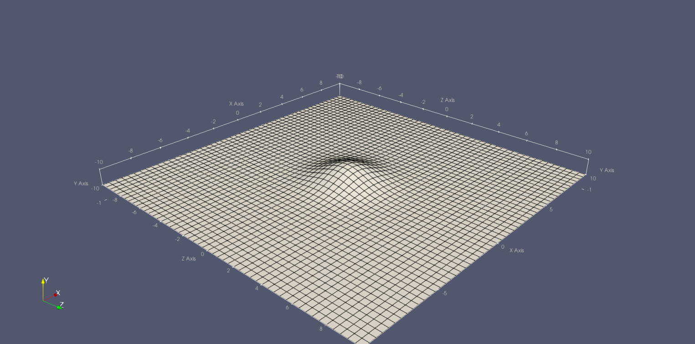
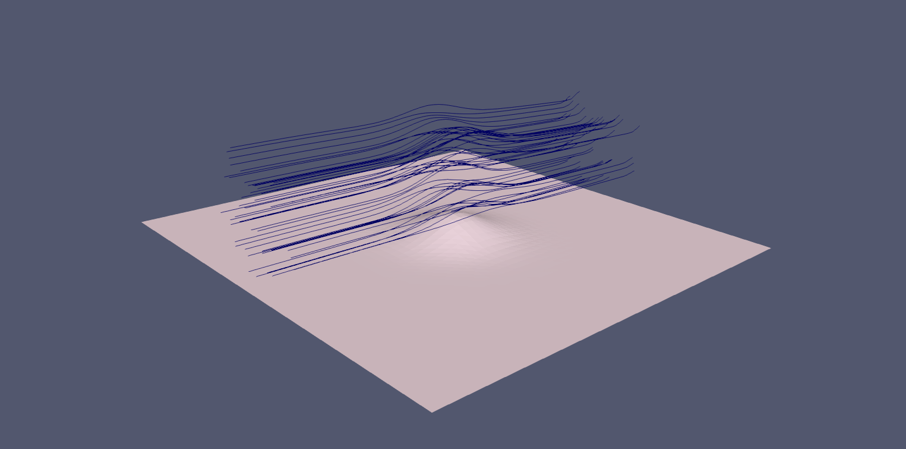
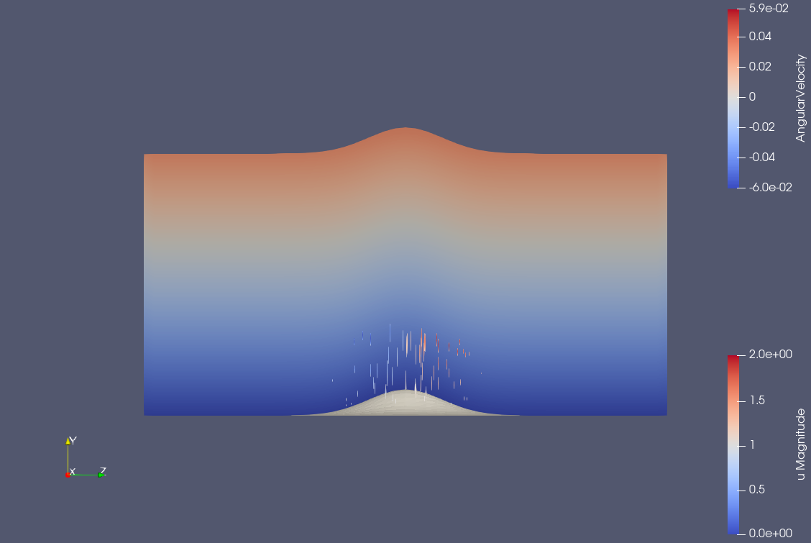
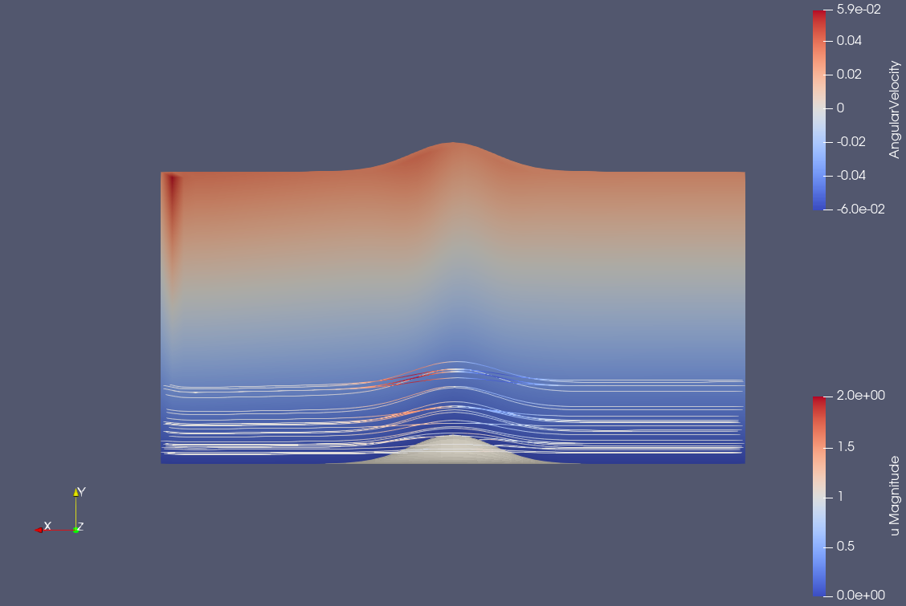

# Hump3FluidFlow

This is a repository for the fluid dynamics project of my first term during my master's degree in Higher School of Economics, Moscow.

The project is designed to apply double-deck boundary layer theory to the task of fluid flow around a small 3D hump. Firstly, asymptotic methods were applied to achieve the mathematical model of the process. Then with the finite difference approach numerical solution was obtained.

The repository relates to the numerical modeling with finite difference method for developed mathematical solution.

*work is still in progress*

The hump itself:
 

Current results:
1) 3D view of resulted flow with streamlines: 
 

2) YZ projection with streamlines and color:
 

3) XZ projection streamlines and color:
 

